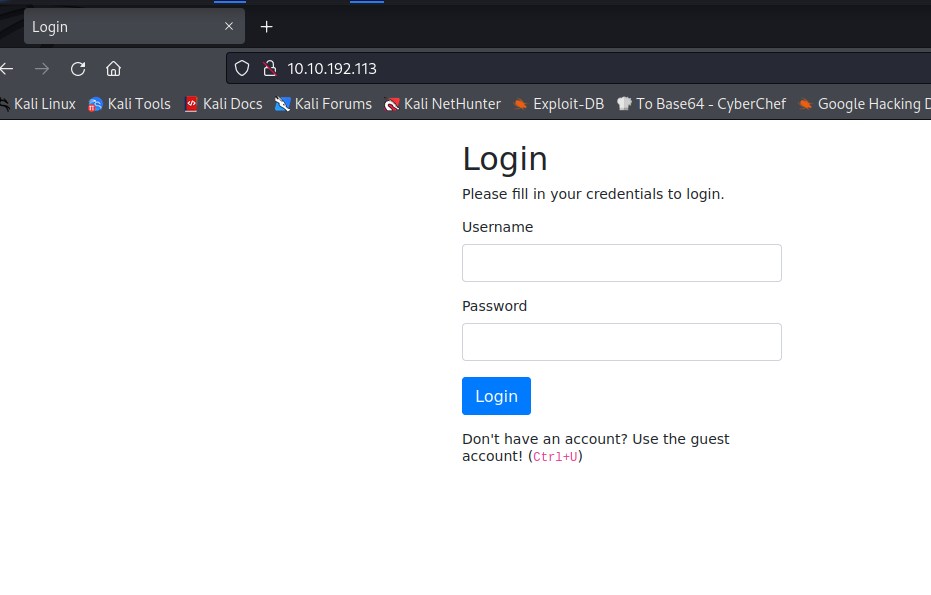
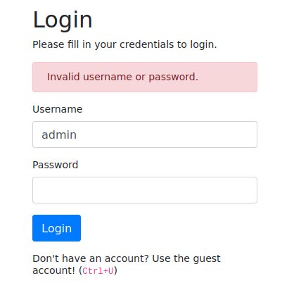
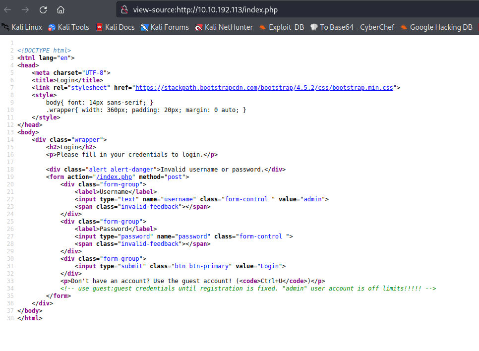
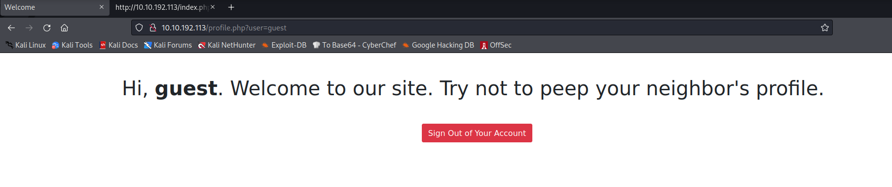
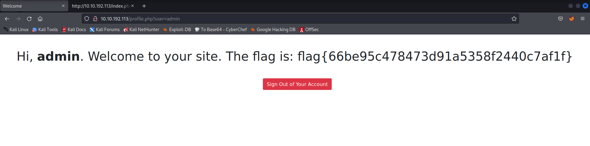
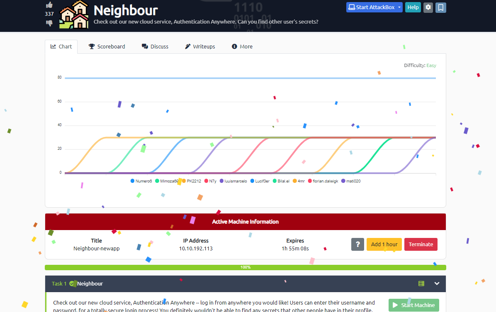

## IP maszyny: 
10.10.192.113

### Sprawdzanie połączenia: 

└─$ ping -c 5 10.10.192.113                                                                                  
PING 10.10.192.113 (10.10.192.113) 56(84) bytes of data.
64 bytes from 10.10.192.113: icmp_seq=1 ttl=63 time=49.4 ms
64 bytes from 10.10.192.113: icmp_seq=2 ttl=63 time=47.8 ms
64 bytes from 10.10.192.113: icmp_seq=3 ttl=63 time=50.1 ms
64 bytes from 10.10.192.113: icmp_seq=4 ttl=63 time=49.0 ms
64 bytes from 10.10.192.113: icmp_seq=5 ttl=63 time=47.9 ms

--- 10.10.192.113 ping statistics ---
5 packets transmitted, 5 received, 0% packet loss, time 4006ms
rtt min/avg/max/mdev = 47.794/48.854/50.106/0.877 ms

### Sprawdzanie co jest pod podanym adresem IP: 

Próba logowania admin:admin:

Ctrl+u: 

Logowanie podanymi danymi - guest:guest

Zmiana w URL z guest na admin dała dostęp do konta admina i flagi: 

# flag{66be95c478473d91a5358f2440c7af1f}
